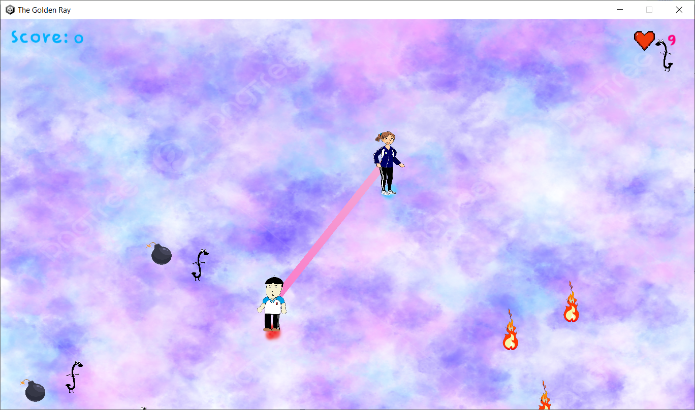
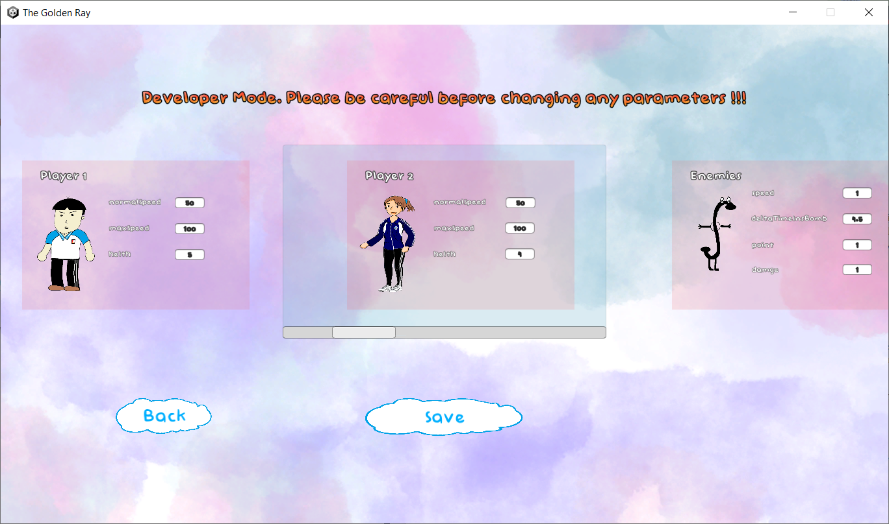

# The Golden Ray

Sử dụng Unity engine

## Gameplay

Game The Golden Ray yêu cầu cần có một hoặc hai người chơi nhập vai vào hai nhân vật giữ
hai đầu của một sợi dây - "vũ khí". Người chơi phải kết hợp với nhau điều khiển hai nhân vật, di chuyển khéo léo né tránh, dùng sợi dây tiêu diệt kẻ địch và  bom trước khi bom nổ để tránh gây nguy hiểm về sau.

## Đối tượng trong game

+ Man & Woman:  Man và Woman là hai nhân vật chính trong trò chơi. Hai người sở hữu các thuộc tính khá giống nhau nhưng sở hữu riêng hai bộ phím điều khiển tách biệt.
+ ConnectLine: Sức mạnh của tình bạn, tình đồng chí giữa hai nhân vật là khởi nguồn sức mạnh của sợi dây này. Nó sẽ giúp hai người chơi tiêu diệt các kẻ địch và phá bom, cùng nhau vượt qua khó khăn để xây dựng một tình bạn thật bền vững.
+ Enemies: Kẻ địch với hai nhân vật trong trò chơi, chúng sẽ lùng sục để giết chết hai bọn họ cho đến hơi thở cuối cùng. Ngoài ra, trên người những "kẻ liều lĩnh" này còn mang theo một lượng lớn bom khiến sự nguy hiểm của chúng càng tăng lên gấp bội.
+ Spawners: Nơi mà những con quái vật trên được sinh ra. Nơi này hoàn toàn nằm ngoài khỏi tầm mắt của hai nhân vật chính nên việc phá huỷ nó là hoàn toàn bất khả thi !!
+ Bomb: Người cung cấp số bom cho những con quái vật liều lĩnh trên là một ẩn số. Mỗi con quái vật có nhiệm vụ mang một quả bom trong người, và sẽ thả bom ra ngoài khi thời cơ chín muồi. Nếu hai nhân vật không phá huỷ bom trước khi nó phát nổ thì hậu quả sẽ khôn lường. Vụ nổ sẽ kéo theo hàng loạt vụ cháy lớn xung quanh, gây rất thêm rất nhiều nguy hiểm.
+ Fire: Hậu quả của việc không kịp phá bom. Không có cách nào để dập những ngọn lửa này. Người chơi chỉ có thể tránh xa và cầu nguyện cho bản thân mình. Tất nhiên, lửa cũng sẽ tắt sau một thời gian nhất định.

Các thông số vật lý của các đối tượng trên đều có thể điều chỉnh.

